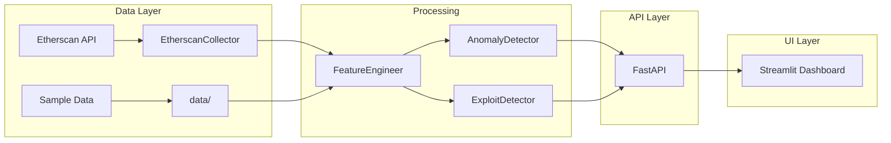

# 💫 AltFlex: AI-Powered Forensic Framework for Exploit Detection in Web3 Cross-chain Bridges and DeFi Protocols

<!-- 🤖 Machine Learning 🤖 -->
<div align="center">


</div>

## A. Project Overview
AltFlex is an integrated AI and digital forensics framework designed to proactively detect and analyze security exploits in cross-chain bridges and DeFi protocols. By combining machine learning anomaly detection with blockchain forensic analysis, the system provides a comprehensive security solution for the rapidly evolving Web3 ecosystem.

## B. Problem Statement
DeFi protocols and cross-chain bridges are increasingly vulnerable to exploits, resulting in significant financial losses. Current security measures often lack the agility and intelligence to detect sophisticated attack vectors. AltFlex addresses this critical need by providing a proactive and adaptive solution for identifying and mitigating potential exploits using advanced AI/ML techniques.

## C. Objectives
**Primary Objective:**
- Develop a functional AI-powered forensic framework (AltFlex) for automated exploit detection in DeFi and cross-chain environments.

**Secondary Objectives:**
- Implement machine learning models for anomaly detection and pattern recognition in transaction data.
- Create a user-friendly interface for visualizing forensic analysis results.
- Establish a comprehensive database of known exploit signatures and attack patterns.
- Evaluate the framework's effectiveness through rigorous testing and validation against real-world exploit scenarios.

## D. Methodology
The project will be executed in the following phases:
1. **Data Collection**: Gather historical transaction data, smart contract code, and exploit reports.
2. **Data Preprocessing**: Clean, transform, and normalize collected data.
3. **Model Development**: Develop and train AI/ML models for anomaly detection and pattern recognition.
4. **Framework Implementation**: Integrate models into the AltFlex framework with UI and visualization.
5. **Testing and Validation**: Evaluate performance against simulated and real-world scenarios.
6. **Integration and Testing**: Deploy and test in sandboxed blockchain environments.

<!-- 🤖 Blue Pingie 🤖 -->
<div align="center">


</div>

---

## 🚀 Phase 1: Production-Ready Architecture (Flash Loan Detection)

### Architecture Overview



### ✨ Key Features Implemented
| Component | Description | Status |
|-----------|-------------|--------|
| 🔍 **Rule-Based Detection** | 6 detection rules for flash loan patterns | ✅ Complete |
| 🤖 **ML Anomaly Detection** | XGBoost classifier with training pipeline | ✅ Complete |
| 🌐 **FastAPI Backend** | 12 REST API endpoints | ✅ Complete |
| 📊 **Streamlit Dashboard** | 5 interactive pages | ✅ Complete |
| 📦 **Sample Data** | 5 real exploits, 50 transactions | ✅ Complete |
| ✅ **Unit Tests** | 23+ test cases | ✅ Complete |

### 📈 Known Exploits Tracked
| Exploit | Date | Protocol | Loss |
|---------|------|----------|------|
| Euler Finance | 2023-03-13 | Euler | $197M |
| Cream Finance | 2021-10-27 | Cream | $130M |
| Pancake Bunny | 2021-05-20 | PancakeBunny | $45M |
| Harvest Finance | 2020-10-26 | Harvest | $34M |
| bZx Protocol | 2020-02-15 | bZx | $350K |

### 🔌 API Endpoints
| Endpoint | Method | Purpose |
|----------|--------|--------|
| `/health` | GET | Health check |
| `/api/analyze` | POST | Full transaction analysis |
| `/api/address/check` | POST | Check known attackers |
| `/api/exploits` | GET | List known exploits |
| `/api/detect/rules` | POST | Rule-only detection |
| `/api/detect/anomaly` | POST | ML-only detection |

---

## E. Conclusion
AltFlex addresses a critical gap in Web3 security through an innovative combination of artificial intelligence and digital forensics. The proposed framework provides a foundation for proactive security monitoring and comprehensive incident analysis.

---

## F. Project Structure

### Root Directory: `CCSFEN2L-ALTFLEX/`

#### 1. Configuration & Setup
- **`.devcontainer/`**
  - **Purpose**: Contains configuration files for Visual Studio Code Remote - Containers.
  - **Function**: Automates the setup of the development environment.
  - **Key Files**: `devcontainer.json`, `Dockerfile`.

- **`docker-compose.yml`**
  - **Purpose**: Container orchestration configuration.
  - **Function**: Defines the services required to run the full AltFlex application stack.

- **`README.md`**
  - **Purpose**: The central documentation hub ("The Bible") of the project.

#### 2. Data Management
- **`data/`**
  - **Purpose**: Storage for raw and processed forensic datasets.
  - **Note**: Managed via **GitLFS**.

#### 3. Source Code (`src/`)
- **`src/collectors/`**
  - **Purpose**: Data ingestion layer (Python scripts for scraping/fetching data).
  - **Files**:
    - `etherscan_collector.py`: Fetches account transaction history from Etherscan API.
    - `polygonscan_collector.py`: Fetches account transaction history from PolygonScan API.
    - `bridge_monitor.py`: Monitors cross-chain bridge events.
- **`src/forensics/`**
  - **Purpose**: Rule-based detection engine (Signature matching, static analysis).
- **`src/models/`**
  - **Purpose**: Machine Learning engine (GNN, XGBoost models).
  - **Files**:
    - `gnn_analyzer.py`: Graph Neural Network logic for transaction graph analysis.
    - `anomaly_detector.py`: XGBoost-based tabular anomaly detection.
    - `feature_engineer.py`: Feature extraction pipelines.
- **`src/app/`**
  - **Purpose**: User Interface and API layer (Streamlit, FastAPI).

#### 4. Research & Experimentation
- **`notebooks/`**
  - **Purpose**: Sandbox for research and prototyping (Jupyter notebooks).
  - **Content**:
    - `01_data_exploration.ipynb`: Exploratory Data Analysis (EDA).
    - `02_model_prototyping.ipynb`: Prototyping ML architectures.

#### 5. Quality Assurance
- **`tests/`**
  - **Purpose**: Automated testing suite.

---

## G. Getting Started

### Access Links
Once the application is running, you can access the services at:
- **Dashboard (Streamlit)**: [http://localhost:8501](http://localhost:8501)
- **API Docs (Swagger)**: [http://localhost:8000/docs](http://localhost:8000/docs)
- **API Health Check**: [http://localhost:8000/health](http://localhost:8000/health)

### Option 1: Running Locally (Recommended)

**Prerequisites:** Python 3.10+

#### Step 1: Create Virtual Environment
```bash
# Create virtual environment
python -m venv .venv

# Activate (choose your OS):
# Windows PowerShell:
.\.venv\Scripts\Activate.ps1
# Windows CMD:
.venv\Scripts\activate.bat
# Mac/Linux:
source .venv/bin/activate
```

#### Step 2: Install Dependencies
```bash
# Standard (if python/pip in PATH):
pip install -r requirements.txt

# Windows Alternative (if pip not found):
.\.venv\Scripts\pip.exe install -r requirements.txt
```

#### Step 3: Run the Application
Open **two separate terminals** and run:

**Terminal 1 - API Server:**
```bash
# Standard:
uvicorn src.app.main:app --reload --port 8000

# Windows Alternative:
.\.venv\Scripts\python.exe -m uvicorn src.app.main:app --reload --port 8000
```

**Terminal 2 - Dashboard:**
```bash
# Standard:
streamlit run src/app/dashboard.py

# Windows Alternative:
.\.venv\Scripts\python.exe -m streamlit run src/app/dashboard.py
```

#### Step 4: Run Tests (Optional)
```bash
# Standard:
pytest tests/ -v

# Windows Alternative:
.\.venv\Scripts\python.exe -m pytest tests/ -v
```

### Option 2: Running with Docker
```bash
# Build and start all services
docker-compose up -d --build

# Stop services
docker-compose down
```

### 🔧 Troubleshooting

| Issue | Solution |
|-------|----------|
| `pip not found` | Use `.\.venv\Scripts\pip.exe` instead |
| `python not found` | Use `.\.venv\Scripts\python.exe` instead |
| `Module not found` | Ensure you activated the virtual environment |
| `Port already in use` | Change port: `--port 8001` |
| `API offline in dashboard` | Start the API server first before dashboard |


<!-- 🤖 Machine Learning 🤖 -->
<div align="center">


</div>


<!-- 🏆 Contributers down below -->
# 🏆 Contributing     

### Contributing     
If you would like to contribute to the Flight Booking App, please follow these steps:
1. Fork the repository.
2. Create a new branch for your feature or bug fix.
3. Make your changes and commit them.
4. Push your changes to your forked repository.
5. Submit a pull request to the main repository.


### 🧠 Submitting Changes

🧠 Contributions are welcome! If you have ideas for improvements or want to add more exercises, follow these steps:

1. Fork the repository.
2. Create a new branch.
3. Make your changes and commit them.
4. Push to your fork and submit a pull request. 💕💕💕💕

<!-- Contributors down below, kindly paste your github URL thanks and also you can revise your suited job title position -->
### 👋 Contributors
### Special thanks to all my groupmates: 
 * ####  😎 [Jay Arre Talosig](https://github.com/flexycode) - Machine Learning Engineer | Blockchain Developer | AI Architect    
 * ####  🕵️‍♀️ [Rinoah Venedict Dela Rama](https://github.com/Noah-dev2217) - Python Developer | QA Engineer | Data Engineer 
 * ####  🕵️ [Alexander Castilo](https://github.com/xandercastillo0904) - Penetration Tester | Software Engineer | Threat Researcher
 * ####  🥷 [Nicko Nehcterg Dalida](https://github.com/nicknicndin) - Digital Forensics Analyst | QA Engineer | Smart Contract Auditor
 * ####  🧑‍💻 [Mark Jhosua Taberna](https://github.com/MjTaberna) - Digital Forensics Analyst | UI Specialist | Full Stack Engineer

### 🤝 Collab
 * ####  🧊 [Brian Carlo De Vera](https://github.com/scarfer14) - QA Engineer | Cybersecurity Engineer | Network Engineer


# 🛸 FAQ
<!--  Reporting issues -->
### 🛸 Reporting Issues

```bash
Some changes need to be address
- TBA
- TBA
- TBA
```

# 📫 Changelogs 
Chronological list of updates, bug fixes, new features, and other modifications for our Software Engineering Project.

## 💻 [01.0.0] - 2025-11-17      
### Role & Project Management
- 💻 Final Project requirements for our project

## 💻 [01.1.0] - 2025-11-24      
### Role & Project Management
- 💻 Construct the important folder in the overall 

## 💻 [02.0.0] - 2025-11-25      
### Development Progress
- 💻 Initial project structure setup
- 📁 Created `src/`, `data/`, `tests/`, `notebooks/` directories
- 🔧 Configured `.devcontainer` for VS Code development

## 💻 [03.0.0] - 2025-12-04      
### Development Progress
- 📝 Documentation structure established
- 🐳 Docker configuration added (`docker-compose.yml`)
- 📋 Requirements planning completed

## 💻 [04.0.0] - 2025-12-08
### AI/ML Component Integration
- 💻 **Collectors**: Added `etherscan_collector.py`, `polygonscan_collector.py`, and `bridge_monitor.py`.
- 💻 **Models**: Added `gnn_analyzer.py`, `anomaly_detector.py`, and `feature_engineer.py`.
- 💻 **Notebooks**: Added data exploration and model prototyping notebooks.

## 🚀 [05.0.0] - 2025-12-17
### Phase 1: Production-Ready Flash Loan Detection Platform
- 🔍 **Exploit Detector**: Implemented 6 rule-based detection rules for flash loan attacks
- 🤖 **Anomaly Detector**: Complete XGBoost implementation with training pipeline (265 lines)
- 📊 **Feature Engineer**: Flash loan-specific feature extraction (185 lines)
- 🌐 **FastAPI Backend**: Expanded to 12 API endpoints (400+ lines)
- 📱 **Streamlit Dashboard**: Full 5-page interactive UI (450+ lines)
- 📦 **Sample Data**: 
  - `flash_loan_exploits.json`: 5 real exploit signatures ($406M+ tracked)
  - `sample_transactions.csv`: 50 transactions (12 malicious samples)
- ✅ **Testing**: 23+ unit tests, API integration tests
- ⚙️ **Configuration**: Added `.env.example`, updated `requirements.txt` (15+ dependencies)

## 🔧 [05.1.0] - 2026-01-07
### Bug Fixes & Stability Improvements
- 🌐 **API**: Fixed `uvicorn` startup configuration to support hot-reloading by using import strings.
- 📱 **Dashboard**: Fixed critical navigation bug in "Quick Actions" using state callbacks.
- ✅ **Verification**: Validated end-to-end functionality of API and Dashboard using sub-agent verification.


### Commit message for pushing or pull-request  
🧊 CCSFEN2L ALTFLEX

<!-- This comment is intended for commiting message in pull-request 
Always use this "🧊 CCSFEN2L ALTFLEX" for commiting message for "Pull-request"
<!-- End point line for this comment  -->

<!-- Introduction Pannel button link, it will redirect to the top -->
#### [Back to Table of Content](#-introduction)

<!-- End point line insert Thanks for visiting enjoy your day, feel free to modify this  -->
---
<p align="center">

</p>

<!-- Software Engineering -->
<div align="center">


</div>

<!-- End point line insert Comeback again next time, feel free to modify this  -->
<p align="center">

</p>

</p>
    
<br>
<!-- End point insert background effect line of sight color red -->


