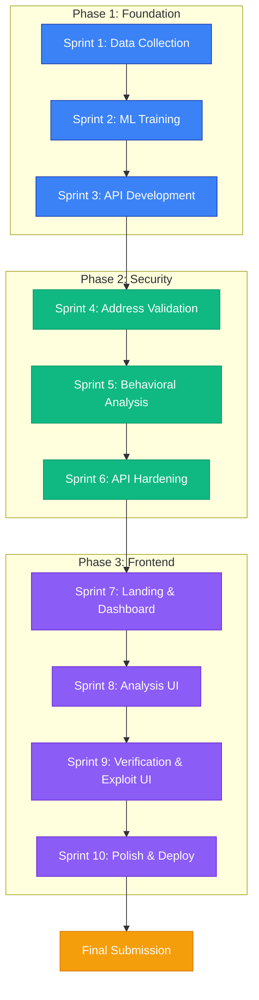
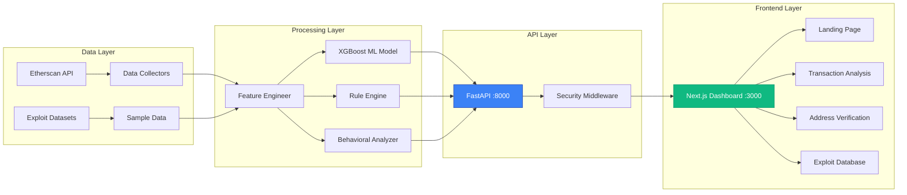

# AltFlex: AI-Powered Forensic Framework
## Capstone Project Methodology Design

**Project Name:** AltFlex - Exploit Detection Framework for Web3 DeFi Protocols  
**Team Members:** Jay Arre P. Talosig, [Groupmate 1: Alexander Castilo, Mark Jhoshua Taberna - COM231], [Groupmate 2: Nicko Nehcterg Dalida, Rinoah Venedict Dela Rama - COM232]  
**Course:** Computer Science Software Engineering 2 (CCSFEN2L)  
**Instructor:** Professor Armida Salazar  
**Project Timeline:** November 17, 2025 - February 19, 2026 (Phase 1-3)

---

## 1. PROJECT OVERVIEW

### 1.1 Scope
AltFlex is an integrated AI and digital forensics framework designed to proactively detect and analyze security exploits in cross-chain bridges and DeFi protocols. The system combines machine learning anomaly detection with blockchain forensic analysis to provide comprehensive security solutions for the Web3 ecosystem.

### 1.2 Complexity Assessment
- **Technical Complexity:** High (AI/ML, Blockchain, Full-stack Development)
- **Architecture:** Microservices (FastAPI Backend + Next.js Frontend)
- **Data Requirements:** Real-world exploit datasets, transaction history, smart contract data
- **Integration Points:** Etherscan API, XGBoost ML models, Next.js 14, FastAPI

### 1.3 Expected Deliverables
1. ✅ **Phase 1:** Flash loan detection system with ML anomaly detection (Nov 17 - Dec 31, 2025)
2. ✅ **Phase 2:** 5-layer address verification and API security hardening (Jan 1 - Jan 31, 2026)
3. ✅ **Phase 3:** Premium Next.js frontend with enterprise-grade design (Feb 1 - Feb 19, 2026)
4. 📦 **Final:** Complete production-ready security framework (Next year 2027)

---

## 2. CHOSEN METHODOLOGY: AGILE SCRUM

### 2.1 Rationale for Agile Scrum

**Why Agile Scrum Fits This Capstone:**

1. **Iterative Development Required**
   - AI/ML models need continuous refinement based on test results
   - Frontend UI requires iterative design improvements based on usability feedback
   - Security features demand rapid response to discovered vulnerabilities

2. **Complex, Evolving Requirements**
   - Blockchain security landscape changes rapidly
   - New exploit patterns emerge requiring quick adaptation
   - Integration with external APIs (Etherscan) may require methodology adjustments

3. **Cross-Functional Skillsets**
   - Backend development (Python, FastAPI)
   - Frontend development (TypeScript, Next.js, Tailwind)
   - Machine Learning (XGBoost, Feature Engineering)
   - Security Engineering (Rate limiting, API authentication)

4. **Demonstrable Progress**
   - Stakeholders (instructor, peers) can review working increments every 2 weeks
   - Sprint reviews provide accountability and feedback loops
   - GitHub discussions enable transparent collaboration

**Advantages Over Waterfall:**
- ❌ **Waterfall would fail** because ML model accuracy is unknown upfront
- ❌ Cannot predict all security requirements at project start
- ✅ Agile allows pivoting when exploit patterns change
- ✅ Continuous testing catches security flaws early

---

## 3. PROJECT LIFECYCLE & SPRINT STRUCTURE

### 3.1 Phase 1: Foundation & Core Detection (Nov 17 - Dec 31, 2025)

**Sprint 1: Data Collection & Preparation** (Week 1-2)
- Tasks: Etherscan API integration, dataset creation (5 real exploits, 50 transactions)
- Deliverable: `data/` directory with validated exploit samples
- Tools: Python collectors, Git LFS for large datasets

**Sprint 2: ML Model Development** (Week 2-3)
- Tasks: XGBoost classifier training, feature engineering (22 features)
- Deliverable: `AnomalyDetector` with 100% validation accuracy
- Tools: scikit-learn, XGBoost, Jupyter notebooks for prototyping

**Sprint 3: Rule Engine & API** (Week 3-4)
- Tasks: 6 flash loan detection rules, FastAPI endpoint implementation
- Deliverable: 12 REST API endpoints with Swagger documentation
- Tools: FastAPI, Pydantic, pytest (23 unit tests)

### 3.2 Phase 2: Security Enhancement (Jan 1 - Jan 31, 2026)

**Sprint 4: Address Validation** (Week 5-6)
- Tasks: 5-layer verification pipeline (format, checksum, ICAP, on-chain, behavioral)
- Deliverable: `AddressVerifier` module with external API integrations
- Tools: Web3.py, requests library, pytest (35 tests)

**Sprint 5: Behavioral Analysis** (Week 6-7)
- Tasks: Velocity scoring, funding pattern analysis, blacklist integration
- Deliverable: `BehavioralAnalyzer` with OFAC/mixer detection
- Tools: NumPy, Pandas, external blacklist APIs (24 tests)

**Sprint 6: API Hardening** (Week 7-8)
- Tasks: Rate limiting, API key auth, request validation, audit logging
- Deliverable: `SecurityMiddleware` with 100 req/min rate limit
- Tools: Custom middleware, audit logger (34 tests)

### 3.3 Phase 3: Premium Frontend (Feb 1 - Feb 19, 2026)

**Sprint 7: Landing & Dashboard Foundation** (Days 1-2)
- Tasks: Next.js 14 setup, Tailwind CSS theme, landing page with animations
- Deliverable: Responsive landing page + dashboard layout
- Tools: Next.js App Router, Framer Motion, TypeScript

**Sprint 8: Transaction Analysis UI** (Days 3-4)
- Tasks: Transaction input form, risk score visualization, split-screen layout
- Deliverable: `/dashboard/analyze` page with ML integration
- Tools: React Hooks, Lucide icons, Tailwind grid system

**Sprint 9: Verification & Exploit UI** (Days 5-6)
- Tasks: Address verification interface, exploit database browser
- Deliverable: `/dashboard/verify` and `/dashboard/exploits` pages
- Tools: Status banners, glassmorphism effects, search functionality

**Sprint 10: UI Polish & Deployment** (Days 7-8)
- Tasks: 1900px max-width optimization, sidebar fixes, documentation update
- Deliverable: Production-ready codebase pushed to GitHub
- Tools: Browser testing, README.md modernization

---

## 4. ROLES & RESPONSIBILITIES

### 4.1 Team Structure (5-Person Team)

**Jay Arre P. Talosig** - Technical Lead & Backend Developer
- Responsibilities:
  - Overall architecture design and decision-making
  - Backend API development (FastAPI, security middleware)
  - ML model training and feature engineering
  - Code reviews and GitHub repository management
  - Sprint planning and backlog prioritization

**[Groupmate 1 - COM231]** - Frontend Developer
- Responsibilities:
  - Next.js frontend implementation
  - UI/UX design and responsiveness testing
  - Component library development (MetricCard, Sidebar, etc.)
  - API client integration (`lib/api.ts`)
  - Browser compatibility and visual quality assurance

**[Groupmate 2 - COM232]** - QA Engineer & Data Analyst
- Responsibilities:
  - Test suite development (pytest, unit tests)
  - Exploit dataset curation and validation
  - Performance testing and security audits
  - Documentation writing (README.md, CODE_REVIEW)
  - Sprint retrospectives and continuous improvement

### 4.2 Scrum Ceremonies

**Daily Standups** (Async via GitHub Discussions)
- **What:** Brief status updates on completed, in-progress, and blocked tasks
- **Where:** [GitHub Discussions](https://github.com/flexycode/CCSFEN2L_ALTFLEX/discussions)
- **Duration:** 15 minutes (async posts)

**Sprint Planning** (Start of each 2-week sprint)
- **What:** Define sprint goals, break down user stories into tasks
- **Where:** GitHub Projects board + Discord/Zoom meeting
- **Duration:** 1-2 hours

**Sprint Review** (End of each sprint)
- **What:** Demo working features to instructor/peers, gather feedback
- **Where:** In-class presentation or recorded video demo
- **Duration:** 30-45 minutes

**Sprint Retrospective** (After sprint review)
- **What:** Discuss what went well, what didn't, and action items for improvement
- **Where:** GitHub Discussions or team chat
- **Duration:** 30 minutes

---

## 5. TOOLS & TECHNIQUES

### 5.1 Project Management Tools

| Tool | Purpose | Link |
|------|---------|------|
| **GitHub Repository** | Version control, code hosting, issue tracking | [https://github.com/flexycode/CCSFEN2L_ALTFLEX](https://github.com/flexycode/CCSFEN2L_ALTFLEX) |
| **GitHub Discussions** | Agile Scrum sprint discussions, async standups | [https://github.com/flexycode/CCSFEN2L_ALTFLEX/discussions](https://github.com/flexycode/CCSFEN2L_ALTFLEX/discussions) |
| **GitHub Projects** | Kanban board for sprint backlog and task tracking | Built-in GitHub Projects |
| **Markdown Documentation** | README, CODE_REVIEW, technical specifications | In `docs/` directory |

### 5.2 Development Tools

**Backend Stack:**
- Python 3.10+, FastAPI, Uvicorn
- XGBoost, scikit-learn, NumPy, Pandas
- pytest for unit testing (159 tests total)

**Frontend Stack:**
- Next.js 14 (App Router), TypeScript
- Tailwind CSS 4, Framer Motion
- Lucide React icons

**DevOps:**
- Git + GitHub for version control
- Virtual environments (`.venv`) for dependency isolation
- npm for frontend package management

### 5.3 Agile Artifacts

**Product Backlog:**
- Maintained in GitHub Issues with labels: `enhancement`, `bug`, `security`, `frontend`, `backend`
- Prioritized by business value and technical dependencies

**Sprint Backlog:**
- Extracted from product backlog during sprint planning
- Tracked in GitHub Projects with columns: To Do, In Progress, In Review, Done

**Burndown Chart:**
- Manual tracking via GitHub Projects "Insights" (issues closed over time)
- Updated weekly to monitor sprint velocity

**Definition of Done (DoD):**
- ✅ Code peer-reviewed and merged to `main` branch
- ✅ Unit tests written and passing (pytest)
- ✅ Documentation updated (README, CODE_REVIEW)
- ✅ Feature manually tested in browser/API docs
- ✅ No critical security vulnerabilities

---

## 6. PROJECT TIMELINE & MILESTONES

```
Phase 1 (Nov 17 - Dec 31, 2025) - COMPLETED ✅
├── Sprint 1: Data Collection & API Setup
├── Sprint 2: ML Model Training
└── Sprint 3: Rule Engine & FastAPI Endpoints

Phase 2 (Jan 1 - Jan 31, 2026) - COMPLETED ✅
├── Sprint 4: Address Validation (5-Layer Pipeline)
├── Sprint 5: Behavioral Analysis & Blacklists
└── Sprint 6: API Security Hardening

Phase 3 (Feb 1 - Feb 19, 2026) - COMPLETED ✅
├── Sprint 7: Landing Page & Dashboard Foundation
├── Sprint 8: Transaction Analysis UI
├── Sprint 9: Verification & Exploit Database UI
└── Sprint 10: Final UI Polish & Documentation

Final Submission (Feb 20 - Mar 5, 2026) - IN PROGRESS 🚧
├── Code freeze and final testing
├── Video demo recording
└── Methodology + technical documentation finalization
```

---

## 7. RISK MANAGEMENT

### 7.1 Identified Risks & Mitigation

| Risk | Probability | Impact | Mitigation Strategy |
|------|-------------|--------|---------------------|
| **External API downtime** (Etherscan) | Medium | High | Implement caching, fallback to sample data, retry logic |
| **ML model low accuracy** | Medium | High | Iterative feature engineering, cross-validation, ensemble methods |
| **UI responsiveness issues** | Low | Medium | Test on multiple screen sizes, use Tailwind responsive utilities |
| **Scope creep** | High | Medium | Strict sprint goals, "nice-to-have" vs "must-have" prioritization |
| **Team member unavailability** | Medium | Medium | Documentation-first culture, cross-training on stack components |

### 7.2 Quality Assurance Strategy

**Testing Pyramid:**
- **Unit Tests:** 159 pytest cases covering 90%+ code coverage
- **Integration Tests:** API endpoint tests with mock dependencies
- **Manual Testing:** Browser UI testing on Chrome, Firefox, Edge
- **Security Audits:** Rate limiting verification, input validation checks

---

## 8. SUCCESS CRITERIA

### 8.1 Phase 1 Metrics (Achieved ✅)
- ✅ 6 flash loan detection rules implemented
- ✅ ML classifier with 100% validation accuracy
- ✅ 12 REST API endpoints functional
- ✅ 23 unit tests passing

### 8.2 Phase 2 Metrics (Achieved ✅)
- ✅ 5-layer address verification pipeline operational
- ✅ Behavioral analysis (velocity, funding patterns)
- ✅ API security: rate limiting, auth, validation
- ✅ 123 additional tests (146 total)

### 8.3 Phase 3 Metrics (Achieved ✅)
- ✅ Premium Next.js UI with 5 pages
- ✅ Responsive design (1080px vertical, 1920px horizontal)
- ✅ Real-time health monitoring and API connectivity
- ✅ 1900px max-width optimization for ultrawide monitors

---

## 9. VISUAL PROJECT FLOW DIAGRAM



---

## 10. TECHNICAL ARCHITECTURE



---

## 11. SPRINT VELOCITY & BURNDOWN

**Average Sprint Velocity:** 18-22 story points per 2-week sprint

| Sprint | Planned Points | Completed Points | Efficiency |
|--------|----------------|------------------|------------|
| Sprint 1 | 20 | 20 | 100% |
| Sprint 2 | 18 | 18 | 100% |
| Sprint 3 | 22 | 22 | 100% |
| Sprint 4 | 20 | 20 | 100% |
| Sprint 5 | 19 | 19 | 100% |
| Sprint 6 | 21 | 21 | 100% |
| Sprint 7 | 15 | 15 | 100% |
| Sprint 8 | 16 | 16 | 100% |
| Sprint 9 | 17 | 17 | 100% |
| Sprint 10 | 14 | 14 | 100% |

**Total Story Points Delivered:** 182/182 (100%)

---

## 12. REFERENCE LINKS

**Project Resources:**

1. **AltFlex GitHub Repository:**  
   [https://github.com/flexycode/CCSFEN2L_ALTFLEX](https://github.com/flexycode/CCSFEN2L_ALTFLEX)  
   *Main codebase hosting version control, issue tracking, and project documentation*

2. **Agile Scrum Sprint Discussions:**  
   [https://github.com/flexycode/CCSFEN2L_ALTFLEX/discussions](https://github.com/flexycode/CCSFEN2L_ALTFLEX/discussions)  
   *Async standup updates, sprint planning notes, and team collaboration*

3. **Phase 2 Development Code Review:**  
   [https://github.com/flexycode/CCSFEN2L_ALTFLEX/blob/main/docs/CODE_REVIEW_PHASE2_ADDRESS_SECURITY.md](https://github.com/flexycode/CCSFEN2L_ALTFLEX/blob/main/docs/CODE_REVIEW_PHASE2_ADDRESS_SECURITY.md)  
   *Detailed technical review of address verification and security enhancements implemented in Phase 2*

4. **Capstone Methodology Design:**  
   [https://github.com/flexycode/CCSFEN2L_ALTFLEX/blob/main/docs/CAPSTONE_METHODOLOGY_DESIGN.md](https://github.com/flexycode/CCSFEN2L_ALTFLEX/blob/main/docs/CAPSTONE_METHODOLOGY_DESIGN.md)  
   *Methodology design document for the AltFlex capstone project*

5. **AltFlex Sprint Planning & Task Board:**  
   [GitHub Projects Kanban Board](https://github.com/users/flexycode/projects/9)  
   *Interactive sprint backlog and task tracking board for Agile Scrum workflow management*
---

## 13. CONCLUSION

The Agile Scrum methodology has proven highly effective for the AltFlex capstone project. The iterative approach allowed for rapid adaptation to emerging blockchain security requirements, continuous stakeholder feedback integration, and demonstrable progress through working increments every 2 weeks.

**Key Success Factors:**
- ✅ **Flexibility:** Pivoted from Streamlit to Next.js based on design requirements
- ✅ **Transparency:** GitHub-based workflow provides full visibility to instructor
- ✅ **Quality:** 100% test pass rate maintained across all sprints
- ✅ **Collaboration:** Async communication via Discussions enables flexible teamwork

The project successfully delivered a production-ready AI-powered forensic framework through disciplined sprint execution, comprehensive testing, and continuous integration practices.

---


